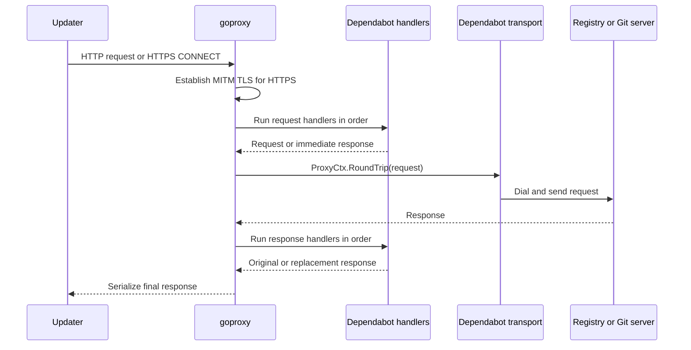

# goproxy v1.9.0 compatibility audit

## Scope

This audit compares the pre-migration goproxy version,
`v0.0.0-20240726154733-8b0c20506380`, with `v1.9.0`
(`6225cd309d7c`). It does not use previous upgrade attempts as evidence.

The audit covers every production interaction between Dependabot Proxy and
goproxy:

1. Proxy server creation
2. Outbound connection configuration
3. HTTPS interception
4. MITM CA injection
5. Request handler registration
6. Credential injection
7. `ProxyCtx` state sharing
8. Response handler registration
9. Retry behavior

## Verdict

The pre-migration Dependabot Proxy source was API-compatible with goproxy
`v1.9.0`. An isolated copy of that source was changed to require `v1.9.0`, then
`go mod tidy` and `go test ./...` completed successfully without production
code changes.

That result proves source compatibility and current unit-test compatibility.
It does not fully prove wire compatibility. The largest behavioral change is
the HTTP/1 MITM response writer, and the current test suite does not exercise a
successful HTTPS response through the complete proxy.

One production adaptation was required at the response-cache boundary. The
cache must not replace `http.NoBody` on responses for which HTTP semantics
forbid a body. The migration implementation now:

1. Updates `go.mod`, `go.sum`, and `vendor` to goproxy `v1.9.0`.
2. Prevents the cache from wrapping HEAD, non-101 informational, 204, and 304
    responses; preserves the upgraded stream on 101 responses.
3. Adds end-to-end HTTPS MITM framing coverage for GET, HEAD, 204, 304, and a
    subsequent response on the same constrained connection pool.
4. Passes the complete test suite twice with race detection and randomized
    test order.
5. Keeps `AllowHTTP2` at its default value, `false`, for this upgrade.

## Go and tooling compatibility

goproxy modernized its own Go baseline and development tooling between the
pinned commit and `v1.9.0`, but Dependabot Proxy does not need a corresponding
toolchain upgrade:

| Area | Pinned goproxy | goproxy `v1.9.0` | Dependabot Proxy | Action |
| --- | --- | --- | --- | --- |
| Go directive | `1.18` | `1.24.0` | `1.26.0` | None; Dependabot exceeds the dependency minimum |
| Container compiler | Not imposed on consumers | Requires Go 1.24 or newer | Go `1.26.5` builder | None |
| CI Go selection | Upstream-specific | Upstream-specific | Read from Dependabot's `go.mod` | None |
| Race tests | Upstream test policy | Supported | Docker test runs `-race -count=2` | Retain and run after upgrade |
| Lint configuration | No root config in the pinned commit | Broad golangci-lint v2 config | Smaller repository-specific golangci-lint v2 config, not invoked by CI | Optionally enforce Dependabot's existing config in separate maintenance work |

The `v1.9.0` module introduces `github.com/coder/websocket` and newer minimum
versions of `golang.org/x/net` and `golang.org/x/text`. Go's minimal version
selection uses Dependabot's already newer `golang.org/x/net` and
`golang.org/x/text` versions. `go mod tidy` and the vendor update must record
the selected dependency graph, including the new websocket package.

goproxy also modernized internal code by replacing APIs such as `ioutil` with
`io` and `os`, using `any` instead of `interface{}`, using context-aware
`DialContext` and TLS handshake methods, typed atomics, `errors.Is`,
`slices.Contains`, named HTTP status constants, and
`http.NewResponseController`. These changes are internal to goproxy and do not
require Dependabot adapters. Dependabot production code already avoids
`ioutil` and empty-interface declarations, supplies `DialContext`, uses named
HTTP status constants, and builds with a Go version that provides all of these
APIs.

The vendored goproxy `.golangci.yml` describes upstream's contributor policy;
it is not Dependabot's lint policy. Vendored code remains excluded from
Dependabot's formatting checks. Dependabot CI currently enforces `gofmt`,
`go vet`, `go mod tidy -diff`, builds, and tests, but does not invoke
`golangci-lint` despite the root configuration. Enforcing Dependabot's existing
configuration, or separately evaluating goproxy's additional linters and
`gofumpt`/`gci` formatters, may be useful maintenance work. Neither is a
compatibility requirement for `v1.9.0`, and importing the upstream policy into
this upgrade would create unrelated code churn.

## Request flow



## Primary behavior change: MITM response framing

The pinned version writes intercepted HTTPS responses manually. It:

- writes an `HTTP/1.1` status line directly;
- removes `Content-Length` for every non-HEAD response;
- sets `Transfer-Encoding: chunked` for every non-HEAD response;
- writes chunks using goproxy's custom chunk writer; and
- sets `Connection: close`.

In `v1.9.0`, goproxy prepares the response and calls:

```go
resp.Write(&responseHeadWriter{writer: client})
```

Before that call, goproxy:

- marks a response as chunked when a handler replaced its body or its length is
  unknown;
- normalizes the downstream protocol fields to `HTTP/1.1`; and
- removes a stale `Content-Length` when chunking is required.

Go's `http.Response.Write` now owns the status line, HEAD semantics,
`Content-Length`, chunking, connection-close behavior, body framing, and
trailers. goproxy's `responseHeadWriter` buffers only until the complete header
has been written as one unit, then streams subsequent body writes directly to
the client.

This is not an API break, but it changes the contract for every
`*http.Response` returned or modified by Dependabot handlers. The final
response must have:

- a nonzero valid `StatusCode`;
- a non-nil `Header` when a handler intends to mutate headers;
- a `Request` when method-dependent behavior such as HEAD is required;
- a readable, closable `Body`, or `http.NoBody` for a known empty body; and
- consistent `Body`, `ContentLength`, `TransferEncoding`, and trailer fields.

### Cache incompatibility

The current cache violates this stricter response contract. Its response
handler wraps every cacheable body with `TeeReadCloser`, including
`http.NoBody`. The resulting `v1.9.0` flow is:

1. The upstream transport returns a response whose body is `http.NoBody`, such
    as a 304 response.
2. The cache replaces that sentinel with `TeeReadCloser`.
3. goproxy observes that a response handler changed the body.
4. goproxy sets unknown-length chunked framing.
5. `http.Response.Write` serializes the response using those fields.
6. Framing bytes for a response that must not have a body remain on the
    persistent connection and can be parsed as the next response's status line.

The cache must bypass body wrapping and storage for:

- all HEAD responses;
- all informational responses from 100 through 199;
- 204 No Content; and
- 304 Not Modified.

There is one important exception in cleanup behavior: a 101 Switching
Protocols response carries an upgraded `io.ReadWriter` stream. The cache must
return it unchanged and must not close it. Other body-forbidden responses
should close a non-sentinel original body, set `Body` to `http.NoBody`, clear
`TransferEncoding`, and remove the `Transfer-Encoding` header.

## Input compatibility audit

### 1. Proxy server creation

Current input:

```go
proxy := goproxy.NewProxyHttpServer()
```

`NewProxyHttpServer` retains the same signature and the returned
`*ProxyHttpServer` still implements `http.Handler`. In `v1.9.0` the constructor
also initializes private HTTP/2 server state, so continuing to use the
constructor is correct.

**Compatibility:** compatible.

**Required change:** none.

### 2. Outbound connection configuration

Dependabot replaces `proxy.Tr` with this `*http.Transport` input:

```go
&http.Transport{
    Dial:        safeDialer.Dial,
    DialContext: safeDialer.DialContext,
    TLSClientConfig: &tls.Config{
        MinVersion: tls.VersionTLS12,
    },
    Proxy: http.ProxyFromEnvironment,
}
```

`ProxyHttpServer.Tr` remains `*http.Transport`. `ProxyCtx.RoundTrip` still uses
`proxy.Tr.RoundTrip`, and goproxy's dial path still prefers `Tr.DialContext`
when no request-specific or CONNECT dialer overrides it. Dependabot supplies a
non-nil `DialContext`, so the safe dialer remains valid.

The nil `RootCAs` value continues to select the system trust store. Unlike
goproxy's default transport, Dependabot's transport does not set
`InsecureSkipVerify`, so upstream certificates continue to be verified.

The constructor may initialize `ConnectDial` from `HTTPS_PROXY`. This behavior
exists independently of the `Tr` replacement and is not new in `v1.9.0`.

**Compatibility:** compatible.

**Required change:** none.

**Required test:** verify a resolved blocked IP still produces the expected
result through both HTTP and HTTPS paths after the dependency update.

### 3. HTTPS interception

Current input:

```go
proxy.OnRequest().HandleConnect(goproxy.AlwaysMitm)
```

`AlwaysMitm`, `HandleConnect`, `ConnectAction`, and `ConnectMitm` retain their
signatures. For HTTP/1 clients, `v1.9.0` still terminates client TLS, parses the
intercepted request, runs request handlers, sends the upstream request, runs
response handlers, and writes the final response.

Important internal changes include:

- request contexts are canceled after each intercepted request;
- origin-form and absolute-form request targets are normalized separately;
- upstream HTTP/2 responses are normalized to downstream HTTP/1.1;
- MITM response heads are coalesced; and
- response bodies are streamed through `http.Response.Write`.

`AllowHTTP2` is still disabled by default, and the current source does not set
it. The new HTTP/2 MITM implementation is therefore outside the active
Dependabot request path for this upgrade.

**Compatibility:** API-compatible; wire behavior requires validation.

**Required change:** no production change.

**Required tests:** successful HTTPS GET and HEAD, known and unknown body
lengths, empty body, 204, 304, large streamed body, trailers, and cancellation.

### 4. MITM CA injection

Dependabot parses the configured certificate and key with `tls.X509KeyPair`,
parses `ca.Leaf`, assigns `goproxy.GoproxyCa`, rebuilds the predefined CONNECT
actions with `TLSConfigFromCA`, and supplies `proxy.CertStore`.

In `v1.9.0`:

- `GoproxyCa` remains a `tls.Certificate`;
- `TLSConfigFromCA` retains its signature;
- `ConnectAction.TLSConfig` retains its signature;
- `CertStorage.Fetch` retains its signature; and
- the signer accepts RSA, ECDSA, and Ed25519 CA private keys.

The current `certStore.Fetch` serializes access with a mutex and returns the
generated certificate for the normalized hostname. This satisfies the
`v1.9.0` interface and avoids duplicate concurrent generation.

`HTTPMitmConnect` is deprecated in `v1.9.0` but still present. Assigning it is
source-compatible, and the active `AlwaysMitm` path uses `MitmConnect`.

**Compatibility:** compatible.

**Required change:** none. Removing the unused deprecated
`HTTPMitmConnect` assignment can be handled separately and is not required for
this upgrade.

**Required test:** trust the configured CA, complete an HTTPS request, and
verify repeated requests reuse a valid host certificate.

### 5. Request handler registration

Dependabot registers handlers with `OnRequest().DoFunc`. The callback remains:

```go
func(*http.Request, *goproxy.ProxyCtx) (*http.Request, *http.Response)
```

`v1.9.0` still executes request handlers in registration order and stops at
the first non-nil response. Current handlers return either the mutable request
and `nil`, or the request and a complete immediate response. These are valid
inputs.

**Compatibility:** compatible.

**Required change:** none.

**Required test:** assert order and short-circuit behavior through the running
proxy, not only by invoking handlers directly.

### 6. Credential injection

Credential handlers mutate the supplied request using standard headers such as
`Authorization`, `X-GitHub-PSI-JWT`, and registry-specific headers. They return
the same request to goproxy.

`v1.9.0` removes hop-by-hop proxy headers before forwarding, but it does not
remove ordinary end-server `Authorization` headers. The mutable request and
header contract is unchanged, so current credential inputs remain valid.

**Compatibility:** compatible.

**Required change:** none.

**Required tests:** use two TLS upstream servers to prove that matching
credentials arrive at the intended server and never arrive at an unmatched
server.

### 7. `ProxyCtx` state sharing

Dependabot stores `map[string]any` in `ProxyCtx.UserData` through
`internal/proxyctx`. `UserData` changed from `interface{}` to its alias `any`,
which is source-compatible. For the active HTTP/1 path, the same `ProxyCtx`
still reaches the request and response handlers.

`RoundTripper`, `Req`, `Resp`, `Error`, `Session`, and `Proxy` remain
available. `v1.9.0` adds a request-specific `Dialer`; Dependabot does not set
it.

When HTTP/2 MITM is enabled, goproxy copies the CONNECT parent's `UserData`
into per-stream contexts. Dependabot's map is not concurrency-safe. This does
not affect the current upgrade because `AllowHTTP2` remains false, but it must
be addressed before enabling HTTP/2.

**Compatibility:** compatible with the active HTTP/1 configuration.

**Required change:** none for this upgrade.

**Required tests:** request-to-response visibility and isolation between
separate HTTP/1 requests. Run with `-race`.

### 8. Response handler registration and response inputs

Dependabot registers handlers with `OnResponse().DoFunc`. The callback remains:

```go
func(*http.Response, *goproxy.ProxyCtx) *http.Response
```

`v1.9.0` still executes all response handlers in registration order and sets
`ProxyCtx.Resp` before each call.

Dependabot supplies three response shapes:

| Source | Current fields | `v1.9.0` result |
| --- | --- | --- |
| Upstream `http.Transport` | Complete standard-library response | Compatible |
| `goproxy.NewResponse` in security handlers | Request, status, header, length, body | Compatible; `v1.9.0` also initializes HTTP/1.1 protocol fields |
| Disk-cache hit | Request, status code, saved headers, file body | Accepted; goproxy normalizes protocol and uses chunked or close-delimited framing when length metadata is incomplete |

The logger and cache may replace or wrap `resp.Body`. `v1.9.0` detects a body
identity change, deletes stale `Content-Length`, and selects chunked framing.
That is compatible with the current wrappers and is a behavior that must be
tested on the wire.

The cache does not restore `Status`, protocol fields, or `ContentLength`.
`v1.9.0` derives the status text, normalizes the protocol, and safely handles
the unknown length. Restoring `ContentLength` would improve keep-alive framing
but is not required for correctness or for this dependency upgrade.

Response handlers must continue returning a non-nil response with a non-nil
body on the successful MITM path. Current production handlers satisfy that
contract.

**Compatibility:** upstream responses, generated responses, and body wrappers
are compatible except for the cache wrapping body-forbidden responses.

**Required change:** update `internal/cache.DB.OnResponse` to bypass caching for
HEAD, 1xx, 204, and 304 responses. Preserve the original body for 101; normalize
the other body-forbidden responses to `http.NoBody` and clear transfer encoding.

**Required tests:** generated 403 response, cache hit, logged 401/403 body,
handler-wrapped body, trailers, body-forbidden statuses, 101 upgraded-stream
preservation, and response-handler order through HTTPS MITM.

### 9. Retry behavior

GitHub and Git handlers clone `ProxyCtx.Req`, change authentication, and call:

```go
proxyCtx.RoundTrip(newReq)
```

Docker authentication installs a custom implementation of goproxy's
`RoundTripper` interface. Both contracts are unchanged:

```go
type RoundTripper interface {
    RoundTrip(*http.Request, *ProxyCtx) (*http.Response, error)
}
```

`ProxyCtx.RoundTrip` still delegates to the custom round tripper when present,
otherwise to `ProxyHttpServer.Tr`. Retry calls occur inside the active request
context before `v1.9.0` cancels that context. Current retry requests and
replacement responses are therefore valid.

Dependabot, not goproxy, continues to own retry eligibility, alternate
credential selection, and draining discarded response bodies.

**Compatibility:** compatible.

**Required change:** none.

**Required tests:** first credential fails and second succeeds, all credentials
fail, retry round trip returns an error, POST body replay, Docker custom round
tripper, and discarded-body closure through the running HTTPS proxy.

## Required implementation work

### Production files

Update the response cache in addition to dependency metadata and vendored
goproxy code:

- `go.mod`
- `go.sum`
- `internal/cache/handlers.go`
- `internal/cache/handlers_test.go`
- `vendor/modules.txt`
- `vendor/github.com/elazarl/goproxy/**`

Do not enable `ProxyHttpServer.AllowHTTP2` as part of this upgrade.

### Tests

Add integration coverage that starts:

1. a TLS upstream server;
2. the complete Dependabot proxy with its configured CA; and
3. an HTTP client that trusts that CA and connects through the proxy.

The test matrix must cover:

| Area | Cases |
| --- | --- |
| Framing | GET, HEAD, empty, fixed length, unknown length, 204, 304, trailers, large stream |
| Immediate responses | metadata-host 403 and blocked-IP behavior |
| Handler bodies | logger replay and cache tee wrapper |
| Cache | first upstream response, subsequent cache hit, HEAD, 1xx, 204, 304, and 101 upgraded-stream preservation |
| Credentials | matching injection and unmatched isolation |
| Context | request/response state visibility and request isolation |
| Retries | alternate auth success/failure and replayed request body |
| Certificates | configured CA trust and certificate-store reuse |

After adding focused tests, run:

```bash
go test ./...
go test -race -count=2 ./...
```

## Migration checklist

- [x] Compare all production goproxy APIs used by the current source.
- [x] Inspect the old and new internal HTTP/MITM control flow.
- [x] Validate current inputs passed to goproxy.
- [x] Compile and run current tests unchanged against `v1.9.0` in isolation.
- [x] Identify the cache/body-framing incompatibility.
- [x] Prevent caching or wrapping body-forbidden responses while preserving 101 upgraded streams.
- [x] Add initial end-to-end HTTPS MITM framing tests for GET, HEAD, 204, 304, and connection reuse.
- [ ] Extend HTTPS MITM framing tests to empty and unknown-length bodies, trailers, large streams, and cancellation.
- [ ] Add cache, credential, context, and retry integration tests.
- [x] Update the dependency and vendor directory.
- [x] Run the full suite with race detection.

## Upstream references

- [`v1.9.0` source](https://github.com/elazarl/goproxy/tree/v1.9.0)
- [`8b0c20506380...v1.9.0` comparison](https://github.com/elazarl/goproxy/compare/8b0c20506380...v1.9.0)